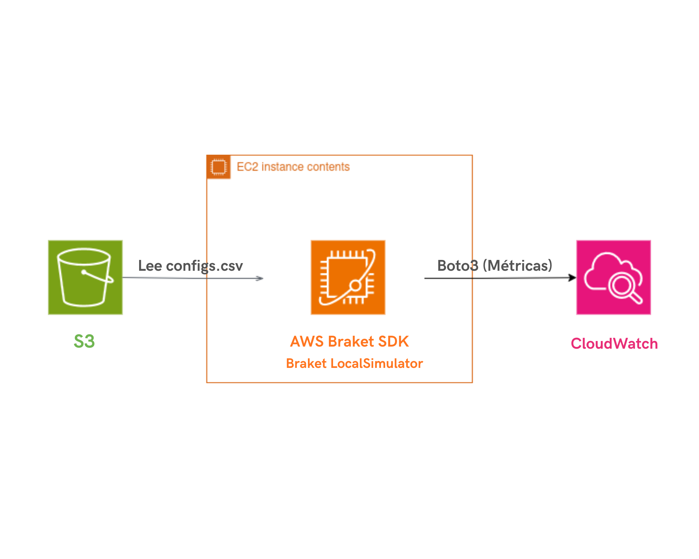

# ⚛️ Arquitectura de Referencia: Pipeline de Integración Híbrida (AWS Cloud + Quantum)

Este repositorio es una **Prueba de Concepto (PoC)** técnica diseñada para la charla *"De lo Clásico a lo Cuántico con AWS"* en el **AWSome Women Summit LATAM 2026**.

---

## 🚀 Propósito del Proyecto (PoC)
Este no es un optimizador de producción. Es un **modelo de integración arquitectónica**. 

El problema real en la industria actual no es solo el algoritmo cuántico, sino la **orquestación**: ¿Cómo llevamos datos de un servidor clásico a una QPU y devolvemos una decisión en milisegundos? Este proyecto resuelve esa "tubería" (pipeline) utilizando servicios nativos de AWS.

## 🗺️ Arquitectura

<p align="center">

  

</p>


## 🏗️ Flujo de Trabajo (The Pipeline)

El valor de esta PoC reside en la **interoperabilidad** entre lo clásico y lo cuántico:

1.  **Ingesta (S3):** Simulación de métricas de infraestructura en crudo.
2.  **Lógica Clásica (EC2):** Filtrado de datos críticos y traducción de métricas a parámetros para el circuito.
3.  **Prototipo Cuántico (AWS Braket):** Ejecución de un circuito parametrizado funcional que actúa como **modelo estructural**.
4.  **Acción (CloudWatch):** Transformación de la probabilidad cuántica en una métrica de negocio (Decisión de Aislamiento).

---

## 🔬 Transparencia Técnica.

Para mantener la integridad técnica de esta demostración, es importante notar que:

* **Circuito Placeholder:** El algoritmo actual utiliza rotaciones $\text{RX}(\theta)$ y entrelazamiento básico. No pretende alcanzar una ventaja cuántica (Quantum Advantage), sino demostrar un **Pipeline Quantum-Ready**.
* **Mapeo Simbólico:** El estado $|11\rangle$ se utiliza como un indicador simbólico de correlación de carga entre dos nodos.
* **Escalabilidad:** La arquitectura está diseñada para que el `LocalSimulator` pueda ser reemplazado por un solver de **QAOA** real en una QPU física con cambios mínimos en el código.

---

## 🛠️ Stack Tecnológico
* **Cloud:** Boto3 (S3, CloudWatch).
* **Quantum SDK:** Amazon Braket.
* **Simulación:** LocalSimulator (para reproducibilidad en vivo).

## 🚀 Cómo probar la PoC

1.  Configura tus credenciales de AWS.
2.  Asegúrate de tener un bucket de S3 con el archivo `configs.csv` (incluido en el repo).
3.  Ejecuta:
    ```bash
    python hibrido_qaoa_demo.py
    ```

---
**Presentado por [Shel-y](https://github.com/Shel-y)** *Software Development Engineering Student @ UVEG | AWS Community Speaker*
